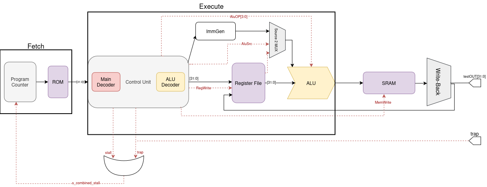

# RV32I-Alpha: Ultra-Low Area RISC-V Core for Artix-7

**RV32I-Alpha** is a high-efficiency, resource-optimized 32-bit RISC-V processor designed specifically for FPGA implementation on the **Digilent Basys 3**. This core serves as a foundation for future research in **ASIC design** and **In-Memory Computing**.

## Architecture Overview

The core implements the **RV32I Base Integer Instruction Set**.

## Implementation results (Basys 3 / XC7A35T)

| Metric | Value | Utilization % |
| :--- | :--- | :--- |
| **Logic Cells (LUT)** | **314** | **1.51%** |
| **Memory (LUTRAM)** | 44 | 0.46% |
| **Flip-Flops (FF)** | **32** | **0.08%** |
| **Block RAM (BRAM)** | 1 | 2.00% |
| **Total On-Chip Power** | **0.1 W** | **Ultra-Low** |
| **Dynamic Power** | 0.028 W | *--* |
| **Worst Negative Slack** | **0.165 ns** | **Timing Met @ 100MHz** |
| **Maximum Frequency** | **101.7 MHz** | *--* |
---
> **Note on data integrity:** All implementation data is derived directly from Xilinx Vivado 2025.2 reports. To ensure transparency, screenshots and reports are available:
> - [View Utilization Report (314 LUTs)](assets/utilization_report.png) | [top_utilization_placed.rpt](reports/top_utilization_placed.rpt) 
> - [View Power Analysis Report (0.1W)](assets/power_report.png) | [top_power_routed.rpt](reports/top_power_routed.rpt) 
> - [View Timing Summary (WNS 0.165ns)](assets/timing_report.png) | [top_timing_summary_routed.rpt](reports/top_timing_summary_routed.rpt) 
## Performance & CPI

To maintain an ultra-low ressource utilization, the core uses a specialized stall logic to manage data flow:

* **General Instructions:** Operations such as ALU computations (`add`, `sub`, `xor`) and branches achieve a **CPI of 1**.
* **Memory Operations:** Due to the synchronous nature of the SRAM and the integrated stall unit, the `LOAD` instruction require **2 cycles** ($CPI = 2$) to ensure data integrity and avoid hazards. However, the `STORE` instruction is done in **1 cycle**.
* **Exception Handling:** Native support for `ebreak` and `ecall` through a dedicated **Trap** signal, allowing for clean program termination and hardware debugging.

## To be done

* **GDSII of the core:** To understand the ASIC flow using Openlane and the Skywater PDK (130nm).
* **Formal verification:** Using RISC-V formal.
* **Custom ISA extension:** Implementation of matrix-vector multiplication (MVM) unit.
---
*Designed and verified via Xilinx Vivado 2025.2 by Badreddine BENFETTOUMA, currently student in University of Bourgogne Europe. My goal is to contribute to researches about DSA and IMC.*
